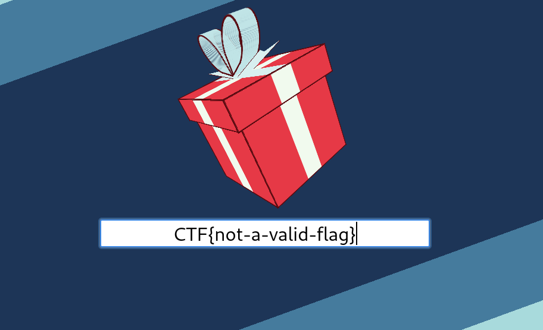

# Google CTF - JS Safe 4.0 Writeup
  
**Category** – Rev   
**Points** – 152   
**Solves** – 78
   
**Description**
```  
You stumbled upon someone's "JS Safe" on the web. It's a simple 
HTML file that can store secrets in the browser's localStorage.
This means that you won't be able to extract any secret from it
(the secrets are on the computer of the owner), but it looks
like it was hand-crafted to work only with the password of the owner...
``` 

## TL;DR
Hidden unicode whitespace characters turn comments into code that is executed. This code transforms the `checksum` function, which is itself padded with a lot of hidden characters, into instructions that modify the getter and setter of the `document.body` `classname` with a custom check for the flag's validity. This check reveals the password and therefore the flag. 

## The whole story
The challenge only consists of one, client-side HTML file `js_safe_4.html`. 
When opening it in a browser, we see the following spinning gift with an input field.  

{width=300}   
   
As the description tells us, it is a "safe" that has been programmed to only work with one password. Let's start looking at the code together.   
We can find a hint at the top of the HTML file:  
```
WARNING: Do NOT modify your HTML once downloaded. Otherwise, it'll stop working
(it'll not accept the correct password) and might compromise your stored data.  
```   
This means, that there is probably some check for the integrity of the file and also anti-debugging technology in place. Our suspicions are supported by more comments claiming a "military grade checksum" implementation.

## The (supposed) code flow
 We enter our password into the following html input field.  
```html
<div>
    <input id="keyhole" autofocus onchange="open_safe()" placeholder="🔑">
  </div>
```  
When ever it's content changes, the `open_safe()` function is called to validate it. 
```js
// Check password and decode encrypted data from localstorage
function open_safe() {
  keyhole.disabled = true;
  password = /^CTF{([0-9a-zA-Z_@!?-]+)}$/.exec(keyhole.value);
  document.body.className = (password && x(password[1])) ? 'granted' : 'denied';
  if (document.body.className == 'denied') return;

  // We don't need to care about anything below this line
  password = Array.from(password[1]).map(c => c.charCodeAt());
  encrypted = JSON.parse(localStorage.content || '');
  content.value = encrypted.map((c,i) => c ^ password[i % password.length]).map(String.fromCharCode).join('')
} 
```  
We can conclude that we entered the correct flag, if x returns true. So let's have a look at x. 
```js
var code = `\x60
  console.log({flag});
  for (i=0; i<100; i++) setTimeout('debugger');
  if ("\x24\x7B\x22   .?  K 7 hA  [Cdml<U}9P  @dBpM) -$A%!X5[ '% U(!_ (]c 4zp$RpUi(mv!u4!D%i%6!D'Af$Iu8HuCP>qH.*(Nex.)X&{I'$ ~Y0mDPL1 U08<2G{ ~ _:h\ys! K A( f.'0 p!s    fD] (  H  E < 9Gf.' XH,V1 P * -P\x22\x7D" != ("\x24\x7B\x22" + checksum(code) + "\x22\x7D")) while(1);
  flag = flag.split('');
  i‍ = 1337;
  pool = 'c_3L9zKw_l1HusWN_b_U0c3d5_1'.split('');
  while (pool.length > 0) if(flag.shift() != pool.splice((i = (i || 1) * 16807 % 2147483647)%pool.length, 1)[0]) return false;
  return true;
\x60`;
setTimeout("x = Function('flag', " + code + ")");
```  
As a way of obfuscating the it, `x` is dynamically assigned the function inside the `code` block. Hmm, since our flag is just compared character by character with the result of `pool.splice(...)` we should be able to dynamically print them out and get the flag! Let's do that!   

## Ahh, my browser is on fire! 
If you have tried this challenge yourself, you might have also encountered the website hanging and rendering it impossible to use, once you opened your **DevTools**.  
This is caused by modifying all the Objects `splice` function which is called by the Developer Tools to get an object's keys.
```js
function splice(start, deleteCount, insert) {
  ret = {};
  // Need to iterate backwards to avoid indexing problems around deleted properties
  for (i = deleteCount; i != 0; i--) key = Object.keys(this)[start+i-1], ret[key] = this[key], delete this[key];
  for (key in insert) this[key] = insert[key];
  return ret;
}
Object.defineProperty(Object.prototype, 'splice', {get:splice});
```
 The DevTools later call the getter without any arguments, resulting in an infinite loop, rendering the site useless.   
Knowing this, I logged the `pool.splice(...)` function and got something – that was not the flag ...

## There is something hidden, I can feel it
At this point, I looked again at the file as a whole and wondered about the broken-unicode characters I saw between a list of TODO's. I copied one and it turned out to be `U+2028`	a [`LINE SEPARATOR`](https://www.utf8-chartable.de/unicode-utf8-table.pl?start=8192&number=128) character. Ha! This means that the comments that looked like this: 
```
// TODO: Whole document integrity check: if (document.documentElement.outerHTML.length == 23082) //...
// TODO: Utility function for detecting the opening of DevTools, https://stackoverflow.com/q/7798748
// TODO: Create wrapper function to support async/await for setTimeout
//       E.g. something like https://stackoverflow.com/q/33289726
// TODO: Checksum check for the utility funcitons themselves, e.g. (checksum(' ' + checksum)) == '...'
```   
Were hiding code *in between the lines* ! After replacing the Line Seperators with newlines, you can clearly make out the hidden code:
```js
// TODO: Whole document integrity check:   
if (document.documentElement.outerHTML.length == 23082) //...
// TODO: Utility function for detecting the opening of DevTools, https://stackoverflow.com/q/7798748
// TODO: Create wrapper function to support async/await for  
   setTimeout
//       E.g. something like https://stackoverflow.com/q/33289726
// TODO: Checksum check for the utility funcitons themselves, e.g.   
(checksum(' ' + checksum)) == '...'
``` 
Or even prettier: 
```js
if (document.documentElement.outerHTML.length == 23082)
setTimeout(checksum(' ' + checksum)) == '...'
```
The first part is a simple integrity check that validates the length of the entire document. You might - though - may not be familiar with the `' ' + checksum` syntax. It simply fetches the **source code** of the `checksum` function (with a prepended space).  
Let's evaluate the expression inside the `setTimeout()`:
```js
pA:Object.defineProperty(document/* `+d({*/.body,'className',{get(){/* ` */return this.getAttribute('class'/* @*/)||''},set(x){this.setAttribute(/* 7 , @@X(tw Y */'class',(x!='granted'/* ,5 @*/||(/* s |L Q4 *//* s |L M *//* Se` h@*//* ( ) N) H 5! =X*//* +d v=A (( *//* (*//^CTF{([0-9a-zA-Z_@!?-]+)}$/.exec(/* * ]#*/keyhole.value)||x)[1].endsWith/* 9 */('Br0w53R_Bu9s_C4Nt_s70p_Y0u'))/* ? [mRP`+d X*/?x:'denied')}})/* */// 
```
After getting rid of the comments and prettifying it a bit, we get the following:

```js  
pA:Object.defineProperty(
document.body,
'className',
{get(){return this.getAttribute('class')||''},
set(x){this.setAttribute('class',
(x!='granted'||
(/^CTF{([0-9a-zA-Z_@!?-]+)}$/.exec(keyhole.value)||x)[1].
endsWith('Br0w53R_Bu9s_C4Nt_s70p_Y0u'))?x:'denied')}}
)
```
This hidden code was evaluated to a string, which was made possible by a lot of invisible whitespace-unicode characters hidden in the `checksum` function, and executed by `setTimeout`. It redefines the `getter` and `setter` for the `document.body`'s `classname` attribute.
 Whenever some function `get`'s it (as `open_safe()` does), we perform a simple check that extracts the flag inside the `CTF{...}` wrapper using a regex and returns **granted** if it ends with **Br0w53R_Bu9s_C4Nt_s70p_Y0u**.   
There we have the flag:   
**CTF{Br0w53R_Bu9s_C4Nt_s70p_Y0u}**

## Mitigate Exploitation
Whenever a key/password is directly baked into the application, it can be reverse engineered. Using a [symmetric key encryption](https://en.wikipedia.org/wiki/Symmetric-key_algorithm) would have made a lot more sense in this case. That wouldn't have offered such a *creative* challenge, though ; )
