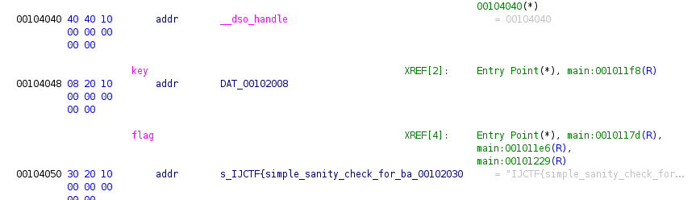
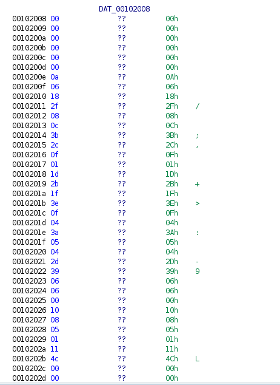

# Sanity - Reversing

`Just testing your sanity`

# Recon
For this Reverse Engineering challenge we are given a 64bit ELF binary that is luckily not stripped which will make reversing it easier.
This information can be seen by running `file sanity`.
After getting that basic information I ran `strings` against the binary and got the following.
```txt
IJCTF{simple_sanity_check_for_babies}
Whats the flag?
Correct!
Wrong!
;*3$"
GCC: (Debian 10.2.1-6) 10.2.1 20210110
```
Because the challenge was labeled **sanity** I of course thought that this was it, but when running the binary and supplying this flag it failed.

Now I loaded it into [ghidra](https://github.com/NationalSecurityAgency/ghidra) to see, what was going on inside the executable.
After looking around for a bit I noticed the two symbols `key` and `flag` <br>
<br>
_flag_ is just the string we saw before, _"IJCTF{simple_sanity_check_for_babies}"_
_key_, on the other hand is a list of hex values as seen here:<br>
<br>

I formatted it to `00 00 00 00 00 00 0a 06 18 2f 08 0c 3b 2c 0f 01 1d 2b 1f 3e 0f 04 3a 05 04 2d 39 06 06 00 10 08 05 01 11 4c 00 00 00 00`

# The Code (disassembled by ghidra)
```c
  // ==================== 1 =====================
  char *__s2;
  int iVar1;
  ulong uVar2;
  size_t sVar3;
  ulong uVar4;
  undefined8 uStack192;
  size_t local_b8 [2];
  char local_a8 [103];
  byte local_41;
  char *local_40;
  long local_38;
  int local_2c;
  // ==================== 2 =======================
  uStack192 = 0x10118c;
  local_b8[0] = strlen(flag);
  local_38 = local_b8[0] - 1;
  local_b8[1] = 0;
  uVar2 = (local_b8[0] + 0xf) / 0x10;
  local_40 = (char *)(local_b8 + uVar2 * -2);
  local_2c = 0;
  while( true ) {
    uVar4 = SEXT48(local_2c);
    (&uStack192)[uVar2 * -2] = 0x101238;
    sVar3 = strlen(flag,*(undefined *)(&uStack192 + uVar2 * -2));
    if (sVar3 <= uVar4) break;
    local_41 = key[local_2c] ^ flag[local_2c];
    local_40[local_2c] = key[local_2c] ^ flag[local_2c];
    local_2c = local_2c + 1;
  }
  // ===================== 3 ====================
  (&uStack192)[uVar2 * -2] = 0x101249;
  puts("Whats the flag?",*(undefined *)(&uStack192 + uVar2 * -2));
  (&uStack192)[uVar2 * -2] = 0x101264;
  __isoc99_scanf(&DAT_00102066,local_a8);
  __s2 = local_40;
  (&uStack192)[uVar2 * -2] = 0x10127a;
  // ====================== 4 =====================
  iVar1 = strcmp(local_a8,__s2,*(undefined *)(&uStack192 + uVar2 * -2));
  if (iVar1 == 0) {
    (&uStack192)[uVar2 * -2] = 0x10128a;
    puts("Correct!",*(undefined *)(&uStack192 + uVar2 * -2));
  }
  else {
    (&uStack192)[uVar2 * -2] = 0x101298;
    puts("Wrong!",*(undefined *)(&uStack192 + uVar2 * -2));
  }
  return 0;
```
The above code can be split into 3 parts:
 1. Assigning needed variables
 2. Computing real flag in memory
 3. Getting user input
 4. Checking user input against flag and outputting result

There are two ways of obtaining the flag now:
  1. Computing flag ourself
  2. Debugging it with gdb and reading flag

# Way 1 - Simulating
(This is what I did during the CTF)
In the calculation part of the decompilation we can see the line
`local_41 = key[local_2c] ^ flag[local_2c];`
which XOR's the key and the flag to get the real character
The following python script simulated this behavior
```python3
flag = "IJCTF{simple_sanity_check_for_babies}"
key = "00 00 00 00 00 00 0a 06 18 2f 08 0c 3b 2c 0f 01 1d 2b 1f 3e 0f 04 3a 05 04 2d 39 06 06 00 10 08 05 01 11 4c 00 00 00 00".split()
for i in range(len(flag)):
  print(chr(ord(flag[i])^int(key[i],16)),end="")
print()
```
> `IJCTF{you_did_not_fall_for_it_right?}`

# Way 2 - Debugging
By simply running `gdb ./sanity` and then breaking (`b *<addr>`) right before the call to `strcmp` we can read out both arguments. 
As you know `rdi` is the first and `rsi` the second argument for functions called in assembly (64bit). They are both pointers to the strings that are to be compared. I first did `x/s $rdi` which returned an empty string, but `x/s $rsi` gave us the flag 
> `IJCTF{you_did_not_fall_for_it_right?}`

Hope you liked the writeup :)
