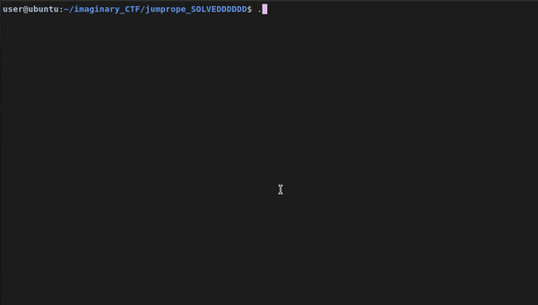

# Jumprope<br>
**Category:** Reverse Engineering<br>
**Points:** 200<br>
**CTF:** [imaginaryCTF 2021](https://2021.imaginaryctf.org) <br>
[TL;DR](#tldr)

# First Look

When examining the binary we are given ([Download here](./jumprope)) with the `file` command, we can see that it is *64bit*, *dynamically linked* and *not stripped* binary, which means the ELF-Executable still has all the symbols, which will make reversing it easier.
Then I of course executed the binary:
```txt
Ice cream!
Soda Pop!
Cherry on top!
Is your flag exact?
Well, let's find out!

Eighty-eight characters!
A secret well kept!
If you get it right,
I'll shout CORRECT!

>>> I_dont_yet_know!
Segmentation fault (core dumped)
```


Strangely we end up segfaulting and not getting a response like **"Wrong flag."**, but we will come back to this behavior later, let's first look at the source code [ghidra](https://github.com/NationalSecurityAgency/ghidra) decompiled for us.

The main function looks like this
```c
undefined8 main(void)

{
  int iVar1;
  
  puts("Ice cream!");
  puts("Soda Pop!");
  puts("Cherry on top!");
  puts("Is your flag exact?");
  puts("Well, let\'s find out!");
  sleep(1);
  puts("\nEighty-eight characters!");
  puts("A secret well kept!");
  puts("If you get it right,");
  puts("I\'ll shout CORRECT!\n");
  iVar1 = checkFlag();
  if (iVar1 == 0) {
    printf("Nope!");
  }
  return 0;
}
```
We see that in the case of a wrong flag, it should print `Nope!` instead of segfaulting, so let's now dig into the **checkFlag** functions code.

```c
undefined8 checkFlag(void)

{
  printf(">>> ");
  __isoc99_scanf("%88s%c",register0x00000020,&dead);
  count = 8;
  while (count < 0x60) {
    val = next(val);
    (&stack0xfffffffffffffff8)[count] =
         (&stack0xfffffffffffffff8)[count] ^
         (byte)val ^ (byte)*(undefined8 *)(x + (long)(count + -8) * 8);
    count = count + 1;
  }
  return 0;
  ```
You may have noticed as well, that we are executing **scanf**, but haven't freed up any space on the stack! (For further information on **scanf** just execute `man scanf`)<br>
I debugged the program in gdb to find out that *register0x00000020* is just *rbp*, or *rsp* as they are the same in this binary (which causes the stack frame, which is the difference of both, to be zero in size)<br>
When executing **scanf** we are therefore overwriting values, like the return pointer, that cause the Segmentation fault.
The above given output by ghidra is good, but not easily understood. I simplified it a bit and it should be clearer now.<br>
(This is more pseudo-code than actual C)<br>
```c
undefined8 checkFlag(void)

{
  printf(">>> ");
  __isoc99_scanf("%88s%c",register0x00000020,&dead);
  count = 8;
  x[760] = {0xfd, 0x3c, 0xc4, 0x0e, 0x76, 0xff, 0x4b, 0x45, 0x1f, 0x40, 0xf4, 0xe6, 0x80, 0xb8, 0xb5, 0xe8, 0x76, 0x8e, 0x3b, 0xf8, 0xe4, 0xbd, 0xc9, 0xc7, 0x3f, 0xe6, 0xcf, 0x15, 0x94, 0x9a, 0x8a, 0x28, 0x4e, 0x5e, 0x1e, 0x3f, 0x25, 0xd4, 0x2c, 0xa9, 0x36, 0x28, 0x42, 0x40, 0x93, 0x8d, 0x0f, 0xff, 0xae, 0x2b, 0x2b, 0xdf, 0x7e, 0x1a, 0x4e, 0x05, 0x63, 0xd0, 0x88, 0xe1, 0xa1, 0x1f, 0x5a, 0x3d, 0x36, 0x4f, 0xae, 0x89, 0x7b, 0xd7, 0x27, 0xd0, 0x29, 0xc0, 0x9e, 0xf0, 0x20, 0xdf, 0x69, 0x77, 0x94, 0xe9, 0x58, 0x0f, 0xb8, 0xec, 0xf9, 0x24}
  char* rbp[?];
  while (count < 0x60) {
    val = (byte)next(val);
             // ↓(user-input)
    rbp[count] =  rbp[count]  ^ val ^ (x [(count-8)] ); 

    count ++;												 
  }
  return 0;
}
```
You could be confused, where the **x** array suddenly comes from. **x** is a symbol that is internally just a pointer. So when doing the following `(byte)(x + 0x1)` we are technically just getting the second element from the pre-defined symbols laying in memory. I got the **x** values by inspecting the x symbol in ghidra and taking every 8th byte (so all not-0x0 bytes)
<br><br>
What suprised me about this function is the missing of any check that would return 1 if the flag was correct, which means it either segfaulted somewhere, or returned 0, which would cause the main function to print *Nope!*.<br><br>
We have now understood that the *while loop* loops over all 88 bytes we supply as the flag (0x60-8, subtracted in the x-index) and that the loop modifies the actual values on the stack and transforms them into some **XOR'ed** version. (Indicated by the **^** operator)
<br>
The missing piece now is the functionality of the **next** function. It does some bitshifting magic and in the end just generates a long stream of seemingly random numbers. I didn't bother reversing it, as it always returned the same numbers I got by debugging it in gdb and breaking right after the function call and printing rax (where the return value of function is put in 64bit binaries).
<br><br>
# Our Goal
Since there is no actual check on what the values on the stack should be after the **XOR** modification, and there is no **CORRECT!** string in the binary (observed with `strings ./jumprope`) I had to think of something else. I had seen the symbols *c*,*o*,*r*,*e* and *t* in the executable before, but didn't give it much attention until now, because which word can you form out of these 5 letters? **core** – nah. **rocet** – also no. But **correct** would work!<br>
<!--<br> -->
In gdb I did `p c` to print the value of the c symbol. For a while I was stuck printing the raw bytes until it dawned me that it could also be a function, which indeed it was! (as well as *o*, *e*, *r* and *t*)<br>
You can print them youself using `x/53i 0x401211`.
```c
   0x401211 <c>:	  push   rbp
   0x401212 <c+1>:	mov    rbp,rsp
   0x401215 <c+4>:	lea    rdi,[rip+0xde8]        # 0x402004 ("C!")
   0x40121c <c+11>:	call   0x401030 <puts@plt>
   0x401221 <c+16>:	mov    edi,0x1
   0x401226 <c+21>:	call   0x401060 <sleep@plt>
   0x40122b <c+26>:	nop
   0x40122c <c+27>:	pop    rbp
   0x40122d <c+28>:	ret 
```
The above function just prints **C!**, sleeps a second and then returns. The *r* and *e* function are exactly the same, but print their respective letters.
It gets a bit more tricky when looking at the behavior of *o* and *t*.
```c
   0x40122e <o>:	  push   rbp
   0x40122f <o+1>:	mov    rbp,rsp
   0x401232 <o+4>:	sub    rsp,0x10
   0x401236 <o+8>:	mov    DWORD PTR [rbp-0x4],edi
   0x401239 <o+11>:	cmp    DWORD PTR [rbp-0x4],0x1337c0d3
   0x401240 <o+18>:	jne    0x401258 <o+42>
   0x401242 <o+20>:	lea    rdi,[rip+0xdbe]        # 0x402007 ("O!")
   0x401249 <o+27>:	call   0x401030 <puts@plt>
   0x40124e <o+32>:	mov    edi,0x1
   0x401253 <o+37>:	call   0x401060 <sleep@plt>
   0x401258 <o+42>:	nop
   0x401259 <o+43>:	leave  
   0x40125a <o+44>:	ret    
```
Before printing the letter, this function (**o**) also checks, whether rdi holds `0x0x1337c0d3`. **T** is the same but checks for `0xdeadface`<br>
By this point I was pretty sure we had to perform some kind of return-oriented-programming or ROP.<br>
If you haven't heard of it before, just know that we are overwriting the return pointer that was placed on the stack when **checkFlag** was invoked by **main**.
The *ret* instruction at the end of **checkFlag** will *pop* our custom value which is the address of **c**.

The Game Plan
--------------
```md
Jump to c               -> 0x00401211

Jump to pop-rdi gadget  -> 0x0040148b
Rdi-value               -> 0x1337c0d3
Jump to o                -> 0x0040122e

Jump to r               -> 0x0040125b
Jump to r               -> 0x0040125b

Jump to e               -> 0x00401278
Jump to c               -> 0x00401211

Jump to pop-rdi-gadget  -> 0x0040148b
Rdi-Value               -> 0xdeadface
Jump to t               -> 0x00401295
```
If we would input it like this though, it would get messed up by the xor that happens in the **checkFlag** function, so lets enrypt our payload now!<br>
**XOR** is a reversible action, which means that if you do `3^5 = 6`, you can recover the original state by doing `5^6 = 3`. So if we encrypt our payload the same way it will later be en-/decrypted in the binary we will have our plain "exploi" laying on the stack read to call those tasty **CORRECT** functions!
```py
#!/usr/bin/env python3
from pwn import *
import sys 
import time

next = [0x85,0x4d,0xf0,0x68,0xd,0x91,0x7b,0x31,0xcb,0x38,0xd5,0x95,0xf4,0xe7,0xdb,0x81,0xc2,0x26,0x78,0xb4,0x86,0xc8,0xbd,0x98,0x65,0x9c,0xea,0x4a,0xfa,0xf3,0xed,0x40,0x61,0x13,0x3c,0x5a,0x43,0xe4,0x5e,0xcc,0x32,0x4e,0x75,0x25,0xfd,0xf9,0x76,0xa0,0xb0,0x9,0x1e,0xad,0x21,0x72,0x2f,0x66,0x19,0xa7,0xba,0x92,0xfe,0x7c,0x3b,0x50,0xd8,0x4,0x8f,0xd6,0x10,0xb9,0x17,0xb3,0x8c,0x53,0x5d,0x49,0x7f,0xbe,0x1d,0x28,0x6c,0x82,0x47,0x6b,0x88,0xdc,0x8b,0x59]
x = [0xfd,0x3c,0xc4,0x0e,0x76,0xff,0x4b,0x45,0x1f,0x40,0xf4,0xe6,0x80,0xb8,0xb5,0xe8,0x76,0x8e,0x3b,0xf8,0xe4,0xbd,0xc9,0xc7,0x3f,0xe6,0xcf,0x15,0x94,0x9a,0x8a,0x28,0x4e,0x5e,0x1e,0x3f,0x25,0xd4,0x2c,0xa9,0x36,0x28,0x42,0x40,0x93,0x8d,0x0f,0xff,0xae,0x2b,0x2b,0xdf,0x7e,0x1a,0x4e,0x05,0x63,0xd0,0x88,0xe1,0xa1,0x1f,0x5a,0x3d,0x36,0x4f,0xae,0x89,0x7b,0xd7,0x27,0xd0,0x29,0xc0,0x9e,0xf0,0x20,0xdf,0x69,0x77,0x94,0xe9,0x58,0x0f,0xb8,0xec,0xf9,0x24]

payload = [0x00401211,0x0040148b,0x1337c0d3,0x0040122e,0x0040125b,0x0040125b,0x00401278,0x00401211,0x0040148b,0xdeadface,0x00401295]

byte_payload = b"" 

for i in payload:
    byte_payload += p64(i,signed="unsigned",endianness="little")
    
xored_byte_payload = b"" 

for i in range(len(byte_payload)):
    xored_byte_payload += int.to_bytes((byte_payload[i]^next[i]^x[i]),1,"big")

print("Payload:",xored_byte_payload)
```
Our payload consists of 11 Values and because scanf takes 88 bytes, those 11 values should all be 8bytes or 64 bit long. That's why I used pwntools **p64()** function to convert the values to 64 bytes.<br>

This will actually already give us the flag!<br>
Payload: **b'ictf{n0t_last_night_but_the_night_bef0re_twenty_f0ur_hackers_came_a_kn0cking_at_my_d00r}'**<br>
<br>
I added the following few lines to the script:
```py
if "x" in sys.argv:
    p = process("./jumprope")

    for i in range(10):
        print(p.recvline())

    input("Attach")
    p.sendline(xored_byte_payload)

    p.interactive()
```
When executing the script like so `python3 solve.py x` we will now start a process and see the magic of our **ROP** chain happen!<br>

<br>
Thanks for hanging around for this long and I hope you learned something!

# TL;DR
To output **CORRECT!** we have to assemble a ROP-chain and encrypt it with the same algorithm the **checkFlag** function uses, which is just *xoring* every byte with one generated and one stored other byte.
This encrypted payload is also the flag:`ictf{n0t_last_night_but_the_night_bef0re_twenty_f0ur_hackers_came_a_kn0cking_at_my_d00r}`<br>
And will print:
```txt
C!
O!
R!
R!
E!
C!
T!
```
